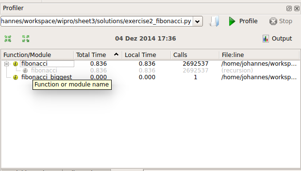

# Measure Execution time


## Use cProfile!

For example:

```python
import cProfile

def fibonacci(k):
    """ Return the k-th fibonacci number """
    if k == 0: return 0
    if k == 1: return 1
    return fibonacci(k-1) + fibonacci(k-2)
cProfile.run('fibonacci(30)')
```

and you'll get an output like this:

```
   2692539 function calls (3 primitive calls) in 1.425 seconds

   Ordered by: standard name

   ncalls  tottime  percall  cumtime  percall filename:lineno(function)
2692537/1    1.425    0.000    1.425    1.425 <ipython-input-4-e025009693b3>:1(fibonacci)
        1    0.000    0.000    1.425    1.425 <string>:1(<module>)
        1    0.000    0.000    0.000    0.000 {method 'disable' of '_lsprof.Profiler' objects}
```

## Spyder

In Spyder, there's the possibility to run 'cProfile' automatically.

Just select 'Run -> Profile' to start the Profiler:


You will get the a nice result output:



In my case the fibonacci function (from sheet 3) needed 0.836 seconds to
calculate the 30th Fibonacci number. A little bit slow. Why is that so?
When we look further we see that the function was called over 2.6 million times,
because we defined it recursively. Those massive amount of function calls add up
to the long execution time!
