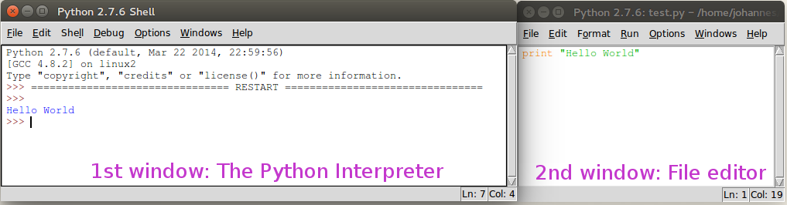

Sheet 0: Python Installation Party
=====================================

Our main goal in this very first exercise is to make sure that everyone has a functioning python environment on his laptop.

Installing Python
-----------------

During our course we need the following packages:

- [Python 2.7](https://www.python.org/downloads/)
- [Numpy](http://sourceforge.net/projects/numpy/files/NumPy/)
- [Matplotlib](http://matplotlib.org/downloads.html)
- [Scipy](http://sourceforge.net/projects/scipy/files/scipy/)

### Miniconda

Miniconda is a completely free Python distribution. It contains a Python interpreter and the package-manager *Conda*. It includes support for over 200 Python packages for science and math. We can use it to download everything required for the our course.

Because it's quite comfortable to use, I recommend it for this tutorial.

#### Installing Miniconda

My recommendation is to download [Miniconda here](http://conda.pydata.org/miniconda.html), install it, and then go to a terminal (Eingabeaufforderung) and use the following command:

```bash
$ conda install numpy matplotlib scipy ipython
```

I tested it on Windows, where it worked like a charm.

Under Linux, you may have to add `~/miniconda/bin` to your **PATH** variable.

#### Uninstalling Miniconda

If you want to uninstall everything related to Python after the semester has ended, it's also fairly easy with Miniconda.

Under Windows, just go to your home directory and look for the Miniconda directory, in my case it's `C:\Users\johannes\Miniconda`. There you will find the `Uninstall-Anaconda.exe` executable to deinstall everything.

Under Linux and MacOS uninstalling is simple. Just remove the `~/miniconda` directory (in my case `/home/johannes/miniconda`).

### Manual Installation

Of course, you don't have to install conda, but you can install all required packages manually.

Under Ubuntu, you can run the following command to install all packages using apt-get.

```bash
$ sudo apt-get install python2.7 python-numpy python-scipy python-matplotlib
```

Under Windows, go to the project websites and install the newest versions.

Under MacOS, if you have [Macports](http://www.macports.org/) installed the most easiest way should be to install everything using the command

```bash
§ sudo port install py27-numpy py27-scipy py27-matplotlib
```


Testing our Python installation
-------------------------------

### The Interpreter

Go to a terminal and type `python`. A python interpreter should greet you:

```
Python 2.7.8 |Continuum Analytics, Inc.| (default, Jul  2 2014, 18:08:02)
[GCC 4.1.2 20080704 (Red Hat 4.1.2-54)] on linux2
Type "help", "copyright", "credits" or "license" for more information.
Anaconda is brought to you by Continuum Analytics.
Please check out: http://continuum.io/thanks and https://binstar.org
>>>
```

Now you should try the following:

```python
>>> 1+1
2
```

If this works, congratulations! Your python interpreter just did his very first calculation.


### IDLE: Your first Python programming environment

*IDLE* is a program where we can create new python files and run them. In a terminal type:

```bash
$ idle
```

This starts up the program. At the beginning only a so-called Python shell is open. At this place you will see the output from your next python programs.

Now, from the program menu, choose "File -> New File". A new window opens, which is an editor for a new file. You can write your first simple program in it:

```python
print "Hello World"
```

From the editors menu, choose "Run -> Run Module" (Shortcut F5). The editor asks you to save the file on a place on your computer. After you saved your file, the text "Hello World" should appear in the first window:



Let's try if all the other packages got installed correctly:

```python
>>> import matplotlib
>>> import numpy
>>> import scipy
```

If you don't got any errors, then you are ready to go!

A final comment
---------------

Make sure that your editor uses four spaces instead of tabs. So whenever you enter a `tab`, the editor replaces the tab with 4 spaces.
